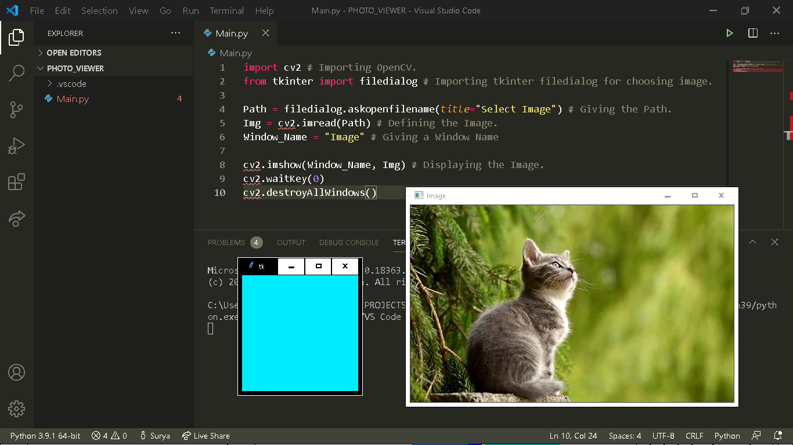

# Python_Image_Viewer
This is an Image Viewer made in Python. I have used OpenCV and tkinter for this. Tkinter is a built in module and comes preinstalled whereas for opencv just type in:
```
pip install opencv
```
And this should work. If it didn't then just go for unofficial Python Binaries. Below is my Code Se=creenshot:


Hope that you liked it.
